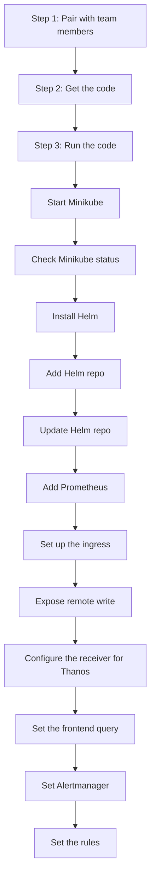

# All the steps in the journey 🚀

1. Step one: Pair with team members 🤝
2. Get the code 💻
3. Run the code 🏃‍♂️

    - Start Minikube
    - Check Minikube status
    - Install Helm
    - Add Helm repo
    - Update Helm repo
    - Add Prometheus (Collect metrics from instance or the pod)
    -- Install with yalm config
    -- Install with parameters at start
    - Set up the ingress
    - Expose remote write (do it from Prometheus with config)
    - Configure the receiver for Thanos
    - Set the frontend query
    - Set Alertmanager
    - Set the rules

prompts:
- Convert or update the mermaid chart
- Add or update emojis
- Fix syntax and grammar
